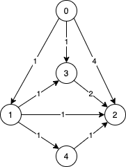
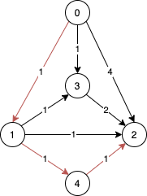
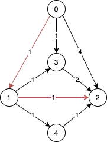
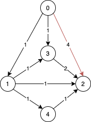

# Shortest path in exact hop
Here, we will find out the shortest weighted path between two nodes of a graph using exact number of steps hops.

Consider the following graph:



Solution with 3 hops:



Solution with 2 hops:



Solution with 1 hop:



Sample input:
```
Enter number of node: 5
Enter number of edge: 8
Enter edge 1
Enter start vertex: 0
Enter to vertex: 1
Enter weight: 1
Enter edge 2
Enter start vertex: 0
Enter to vertex: 2
Enter weight: 4
Enter edge 3
Enter start vertex: 0
Enter to vertex: 2
Enter weight: 1
Enter edge 4
Enter start vertex: 1
Enter to vertex: 3
Enter weight: 1
Enter edge 5
Enter start vertex: 1
Enter to vertex: 2
Enter weight: 1
Enter edge 6
Enter start vertex: 1
Enter to vertex: 4
Enter weight: 1
Enter edge 7
Enter start vertex: 3
Enter to vertex: 2
Enter weight: 2
Enter edge 8
Enter start vertex: 4
Enter to vertex: 2
Enter weight: 1
Enter source vertex: 0
Enter destination vertex: 2
Enter number of hop: 3
Shortest weighted path sum: 3
Selected path: 0 1 4 2
```